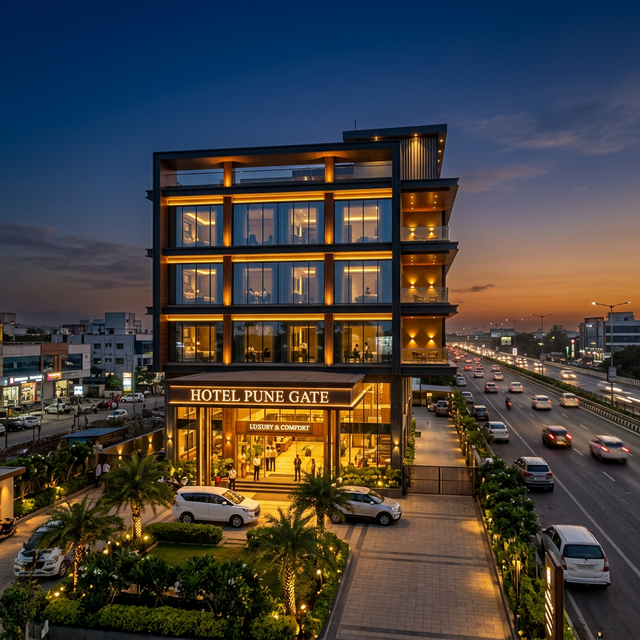

# 🏨 Hotel Pune Gate — Website (Sample UI)

A modern, premium, single-page hotel website UI built as a **sample showcase project**.



## ✨ Features

- **Premium Design** — Deep Navy & Warm Gold palette with Playfair Display headings
- **Mobile-First Responsive** — Optimized for all screen sizes (desktop, tablet, mobile)
- **Conversion Optimized** — Strong hero section, multiple CTAs, floating call button
- **SEO Ready** — Meta tags, Open Graph, Twitter Cards, structured data (JSON-LD)
- **Accessible** — Keyboard navigation, focus outlines, `prefers-reduced-motion` support
- **Smooth Animations** — Scroll-reveal, animated counters, hover effects
- **Google Maps** — Embedded map showing hotel location

## 📁 Project Structure

```
Pune_Gate_Web/
├── index.html      # Main HTML (single-page, 11 sections)
├── index.css       # Complete design system & responsive styles
├── script.js       # Animations, nav, scroll effects
├── images/         # Hotel images (hero, rooms, lobby)
├── .gitignore
└── README.md
```

## 🚀 Getting Started

Just open `index.html` in any browser — no build tools or server required.

```bash
# Or serve locally
npx serve .
```

## 🏗️ Sections

Hero → About → Rooms → Amenities → Why Choose Us → Reviews → Gallery → Location → CTA → Contact → Footer

## 📞 Business Info

- **Phone:** +91 86007 78687
- **Address:** Sr. No 52/4/2, Near Navale Lawns, Mumbai-Bangalore Highway, Narhe, Pune 411041
- **Rating:** 4.3 ⭐ (300+ Reviews)

## 📄 License

© 2026 Hotel Pune Gate. All rights reserved.
